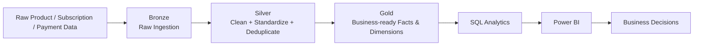

# SaaS Product Growth & Customer Analytics

> A business analytics project that transforms raw SaaS product, subscription and payment data into decision-ready insights across conversion, engagement, retention and revenue.


---

## Executive Snapshot

| Metric | Observed result |
|---|---:|
| Users analyzed | **10,000** |
| Signup → Paid conversion | **39.64%** |
| Enterprise conversion | **61.03%** |
| Small-business conversion | **32.26%** |
| Avg. monthly stickiness | **~13.13%** |
| Variant B vs A | **+4.31 pp** observed conversion |

> **Portfolio note:** The dataset is treated as an analytical/synthetic SaaS dataset. Findings are descriptive unless the underlying experimental design supports causal inference.


## Business Problem

A subscription-based SaaS business needs to understand how users move from acquisition to trial to paid subscription, how consistently they use the product, how long they remain active, and whether recurring revenue growth is coming from new customers or existing customers.

The objective is to convert raw product, subscription, activity and payment data into a structured analytical model that supports decisions across Product, Growth, Customer Success and Revenue teams.

## Business Questions

1. Where are users dropping out of the customer journey?
2. Which acquisition channels generate stronger conversion?
3. How does conversion vary across signup cohorts, company size and other segments?
4. Which customer cohorts retain product usage over time?
5. How engaged are users, measured through DAU, MAU and stickiness?
6. Is revenue growth driven by new customers or existing customers?
7. Does experiment variant performance differ across conversion outcomes?
8. Which segments should be investigated for potential growth or retention opportunities?

## Stakeholders & Decisions

| Stakeholder | Decision supported | Key metrics |
|---|---|---|
| Product Manager | Identify funnel and engagement opportunities | Activation, conversion, retention, stickiness |
| Growth Manager | Evaluate acquisition quality | Channel conversion, funnel drop-off |
| Customer Success | Identify weaker cohorts | Retention, activity, cohort performance |
| Revenue Team | Understand growth composition | New revenue, expansion revenue |
| Leadership | Monitor overall product health | Conversion, retention, revenue, engagement |

## Analytical Approach

```text
Raw Product / Subscription / Payment Data
                  ↓
           Bronze Layer
                  ↓
       Data Quality & Cleaning
                  ↓
            Silver Layer
                  ↓
       Business-ready Gold Layer
                  ↓
        KPI & Segmentation Analysis
                  ↓
             Power BI
                  ↓
       Insights → Actions → KPIs
```

## Data Warehouse Architecture

The project follows a **Bronze → Silver → Gold medallion architecture**.



### Layer responsibilities

- **Bronze** — raw source data retained close to source structure.
- **Silver** — cleaned, standardized and deduplicated data with quality controls.
- **Gold** — business-ready analytical objects optimized for reusable KPIs and decision questions.

📖 **[Explore the data model →](docs/data_model.md)**

## KPI Framework

| KPI | Definition | Decision Use |
|---|---|---|
| Trial-to-Paid Conversion | Paid users ÷ eligible trial users | Measures monetization effectiveness |
| Funnel Drop-off | Users exiting before paid subscription | Identifies leakage |
| Time to Conversion | Days from trial start to paid subscription | Measures monetization speed |
| DAU | Unique users active per day | Measures daily engagement |
| MAU | Unique users active per month | Measures monthly reach |
| Stickiness | Average DAU ÷ MAU | Measures usage frequency |
| Retention | Active cohort users ÷ original cohort | Measures sustained product value |
| New Revenue | Revenue in a user's first revenue month | Measures acquisition-driven growth |
| Expansion Revenue | Revenue after the first revenue month | Measures monetization of existing customers |

## Analysis Included

| Analysis | Business question |
|---|---|
| **Conversion Funnel** | Where are users dropping between signup, trial and paid? |
| **Trial Drop-off & Speed** | How quickly do users convert and where is leakage occurring? |
| **Segment Analysis** | Which customer groups behave differently? |
| **Cohort Retention** | Which signup cohorts continue using the product? |
| **Engagement** | How frequently do users return? |
| **Revenue Growth** | Is growth coming from new or existing customers? |
| **Experiment Analysis** | Are observed variant outcomes different? |

## Observed Findings

The available dataset contains **10,000 users** with an observed signup-to-paid conversion rate of **39.64%**.

A few analytical patterns stand out:

- **Company size:** enterprise users convert at 61.03%, medium businesses at 47.19% and small businesses at 32.26%.
- **Acquisition channel:** ads, referral and organic conversion are relatively close at 39.88%, 39.85% and 39.40%, respectively.
- **Experiment variant:** Variant B has an observed conversion rate of 41.82% versus 37.51% for Variant A, a 4.31 percentage-point difference. This should be statistically validated before interpreting it as a causal effect.
- **Engagement:** average monthly stickiness is about 13.13%, with the calculated series declining to about 10.07% in June 2025.
- **Revenue mix:** existing-customer/expansion revenue becomes increasingly important after the first few months of the observed period.

See [docs/observed_insights.md](docs/observed_insights.md) for the detailed calculations and business questions created by these observations.

## Insight → Action

The project deliberately moves beyond descriptive reporting:

```text
Observed Pattern
      ↓
Business Interpretation
      ↓
Potential Driver / Hypothesis
      ↓
Recommended Investigation
      ↓
Business Action
      ↓
KPI Monitoring
```

**Example:** Small businesses convert at 32.26% versus 61.03% for enterprise customers.

Rather than concluding that company size *causes* the difference, the next analytical step is to investigate activation, onboarding, trial completion and time-to-value by segment.

📖 **[Business Requirements](docs/business_requirements.md)** · **[Stakeholder Map](docs/stakeholder_map.md)** · **[Observed Insights](docs/observed_insights.md)**

## Repository Structure

~~~text
product-analytics-data-warehouse/
│
├── README.md
├── product_analytics_queries.sql
│
├── sql/
│   └── business_analysis.sql
│
└── docs/
    ├── business_requirements.md
    ├── stakeholder_map.md
    ├── KPI_dictionary.md
    ├── executive_summary.md
    ├── observed_insights.md
    ├── assumptions_and_limitations.md
    ├── data_model.md
    └── powerbi_enhancement_spec.md
~~~

## Dashboard

### Power BI Dashboard Preview


The dashboard is designed to move from **performance monitoring → diagnosis → business action**, rather than simply displaying charts.

A proposed four-page dashboard structure is documented in [docs/powerbi_enhancement_spec.md](docs/powerbi_enhancement_spec.md).

## Technical Stack

- **SQL Server / T-SQL** — transformation, analytical views and KPI calculations
- **Medallion Architecture** — Bronze, Silver and Gold layers
- **Power BI** — dashboarding and decision support
- **GitHub** — version control and project documentation

## Assumptions & Limitations

- The project dataset is treated as an analytical/synthetic SaaS dataset.
- Revenue analysis does not claim to represent a complete accounting ledger unless refunds, chargebacks and adjustments are available.
- Conversion, retention and experiment results describe the available data and should not be interpreted as causal without an appropriate experimental design.
- Acquisition efficiency metrics such as CAC and ROAS require marketing-cost data, which is not included in the current model.

## Portfolio Relevance

This project demonstrates the full Business Analytics workflow:

**Business problem → requirements → KPI definition → data modelling → SQL analysis → segmentation → dashboard → insight → business action.**

It is intentionally designed to demonstrate both **technical analytics capability** and **Business Analyst thinking**.

### What this project demonstrates

**Business Analysis** — requirements, stakeholders, KPI definitions and decision framing  
**Data Analytics** — funnel, cohort, engagement, segmentation and revenue analysis  
**Data Engineering** — Bronze/Silver/Gold analytical architecture  
**BI** — reusable SQL outputs and Power BI decision support  
**Analytical Judgment** — assumptions, limitations and causal-inference awareness

### Project focus

**Product Analytics · Business Intelligence · SQL · Data Warehousing · Power BI · KPI Design · Business Analysis**
